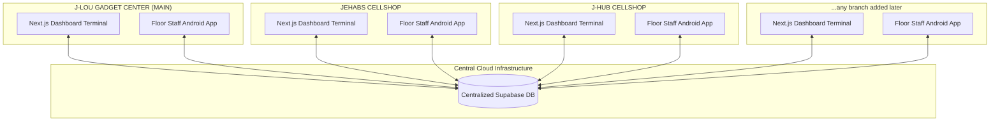

# Centralized Multi-Branch Inventory & Repair Management System

An enterprise-grade inventory synchronization and repair tracking system designed for retail storefronts with multiple locations. It uses a single centralized Supabase PostgreSQL database to coordinate real-time stock levels, retail cashier checkouts, diagnostic repair workflows, and branch-to-branch logistics.

---

## 🏗️ System Architecture



---

## 🗄️ Database Schema Design (Supabase PostgreSQL)

The backend schema features automated constraints, optimized indexing, and triggers that enforce data integrity.

Branches are **not hardcoded**. They are rows in a `branches` table, so stores can be
added, renamed or archived at runtime from either the Android app or the PC dashboard —
no schema change, no rebuild. Every other table references `branches.name` with
`ON UPDATE CASCADE`, so renaming a store rewrites its whole history automatically.

### Tables
1. **`branches` (Store Registry):** The addable list of stores. `name` is the natural key used by every other table; one store can be flagged `is_main`, and archiving (`is_active = false`) hides a store from all dropdowns while keeping its records.
2. **`profiles` (Staff):** Created automatically when a staff account signs up. Holds the display name, role (`owner` / `manager` / `technician` / `cashier`) and home branch.
3. **`retail_gadgets` (Serialized Track):** Stores high-value serialized units (phones and tablets) with unique `imei_1` and `imei_2` fields. Tracks status updates: `In Stock` $\rightarrow$ `In Transit` $\rightarrow$ `Sold` / `Returned`.
4. **`repair_parts` (Bulk Track):** Tracks accessories and bulk spare components (screens, batteries, flexes) by branch using unique composite keys on `(sku, branch_location)`.
5. **`service_tickets` (Repair Tracking):** Records customer repair intakes, tech assignments, diagnostic descriptions, and combined bill totals.
6. **`ticket_parts_used` (Junction Table):** Links consumed repair parts to service tickets. 
   - *Automated Trigger:* On insert/update/delete, triggers automatically subtract/revert physical stock from `repair_parts` and increment/recalculate the ticket's `total_amount`.
7. **`branch_transfers` (Logistics Log):** Logs transfer dispatches and receptions of both Serialized items (tracked by IMEI) and Bulk parts (tracked by SKU).

---

## 📱 Platforms & Features

### 1. Android Mobile Application (`/android-app`)
*Built with Kotlin, Jetpack Compose, CameraX, and Google ML Kit.*
* **Intended Users:** On-the-floor retail assistants and diagnostic technicians.
* **Camera scanner:** Direct hardware camera binding to scan barcodes and 15-digit IMEIs in real-time.
* **Stock-In receipts:** Quick input interfaces for receiving supplier shipments at the branch level, featuring standardized dropdown selections for Storage, RAM, and Suppliers to minimize manual typing.
* **Ticket creation:** Rapid repair intakes for customer walk-ins.
* **Branches tab:** Add a new store straight from the phone — it appears immediately in every dropdown here and on the PC dashboard.
* **Staff sign-in:** The same Supabase account works on both platforms.

### 2. Next.js Web Dashboard (`/web-dashboard`)
*Built with Next.js, React, TypeScript, and CSS Modules.*
* **Intended Users:** Store managers, inventory auditors, and front-desk cashiers.
* **Master Audits:** Searchable, branch-filtered tables showcasing real-time stock balances and low-stock warning limits, complete with a 1-click **Export to CSV/Spreadsheet** feature for printable inventory reports.
* **Retail Cashier:** Interface to check out units. Scans cellphones out by changing status to `Sold` or decrements accessory quantity balances, generating receipts.
* **Service Board:** Interactive technician board to track repair diagnostics, change status, and allocate repair parts.
* **Logistics hub:** Form to dispatch branch-to-branch transfers. Shows transit statuses and handles receiving approvals to automatically update inventory location balances.
* **Branch Manager:** Add, rename, re-flag the main store, or archive a branch, with per-store device / part / open-repair counts.
* **Add forms:** Devices (with IMEI validation), parts and accessories (restocks an existing SKU at that branch instead of duplicating it), and repair tickets — all addable from the browser.
* **Analytics:** Breakdown of store performance, ticket status distributions, and cumulative revenue, computed per branch from the live branch list.
* **Live sync:** A Supabase realtime subscription refreshes the dashboard when a phone logs stock in.

---

## 🛠️ Installation & Setup

### Database Deployment (Supabase SQL Editor)
Execute `supabase/schema.sql` once in your Supabase SQL Editor. It creates the enums,
tables, indexes, triggers, the `receive_branch_transfer()` function and the Row Level
Security policies.

**There is no demo or sample data.** The only rows it inserts are the three real stores
(J-LOU GADGET CENTER, JEHABS CELLSHOP, J-HUB CELLSHOP). Every device, part, ticket and
transfer is added by staff through the apps.

RLS denies everything to anonymous clients, so both platforms require a staff sign-in.
Create the first account from the **Register** screen on either the web dashboard or the
Android app.

### Running the Web Dashboard
1. Navigate to the `web-dashboard` directory.
2. The live project URL and anon (publishable) key are already baked into
   `src/lib/supabase.ts`. They are safe in the client bundle because RLS gates every
   table behind a signed-in account. To point the app at a different project, set
   `NEXT_PUBLIC_SUPABASE_URL` / `NEXT_PUBLIC_SUPABASE_ANON_KEY` in `.env.local` — they
   override the defaults.
3. Install dependencies and start the development server:
   ```bash
   npm install
   npm run dev
   ```
4. Access the portal at `http://localhost:3000`.

### Building the Android App
1. Open the `/android-app` folder inside Android Studio.
2. The project URL and anon key are already set in `com.ryuuflores2006.inventorysystem.data.SupabaseHelper` — change them there only if you point the app at another project.
3. Sync Gradle and hit **Run** to launch the application on an emulator or physical testing device.

### Deploying the Web Dashboard to Vercel
Since this project uses Supabase, deploying to Vercel is seamless:
1. Go to your [Vercel Dashboard](https://vercel.com/) and click **Add New** -> **Project**.
2. Import this GitHub repository.
3. **IMPORTANT:** Under **Root Directory**, click edit and select `web-dashboard`.
4. No environment variables are required — the client falls back to the baked-in project. Set `NEXT_PUBLIC_SUPABASE_URL` / `NEXT_PUBLIC_SUPABASE_ANON_KEY` only if you want a different backend.
5. Click **Deploy**. Vercel will build the web application and assign it a live URL (e.g., `https://your-project-name.vercel.app`).
6. From then on, any commits pushed to the `main` branch on GitHub will be automatically deployed by Vercel.
