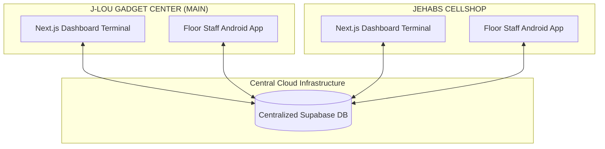

# Centralized Multi-Branch Inventory & Repair Management System

An inventory synchronization and repair tracking system for retail storefronts with
multiple locations. A single centralized Supabase PostgreSQL database coordinates
real-time stock levels, retail cashier checkouts, diagnostic repair workflows, and
branch-to-branch logistics, shared live between an Android app and a PC web dashboard.

**Status:** The schema is deployed and running on the live Supabase project. The three
stores — J-LOU GADGET CENTER (main), JEHABS CELLSHOP and J-HUB CELLSHOP — are set up and
ready for real stock. 

---

## ✨ Premium UI/UX Aesthetic
Both the Web Dashboard and the Android Application feature a fully unified, state-of-the-art premium design system:
- **Glassmorphism**: Translucent cards, frosted glass sidebars, and soft backdrop blurs (backdrop-filter).
- **Dynamic Theming**: Full support for both **Dark Mode** (deep space slate with vibrant cyan/emerald accents) and **Light Mode** (bright, clean frosted interfaces), automatically synced with your system preferences.
- **Micro-animations**: Smooth hover transitions, pulse indicators for live socket connections, and sleek navigation.
- **Custom App Icon**: A highly polished, modern interlocked wrench and smartphone silhouette, optimized for Android Adaptive Icons and Web PWA.

---

## 🏗️ System Architecture



---

## 🗄️ Database Schema Design (Supabase PostgreSQL)

The backend schema features automated constraints, optimized indexing, and triggers that enforce data integrity.

### Core Mechanics
- **Dynamic Branches**: Stores are rows in a branches table, so stores can be added, renamed, or archived dynamically without schema changes.
- **Strict Retail Sales Logic**: Cashiers are strictly prevented from selling stock that is not available in their currently selected branch (record_sale SQL transaction).
- **Automated Inventory Adjustments**: When repair parts are logged as consumed, database triggers automatically subtract the stock and update the ticket total.
- **ACID Transactions**: A phone sale handles payment, stock movement, and status updates atomically, preventing double-selling.

---

## 📱 Platforms & Features

### 1. Android Mobile Application (v1.16)
*Built with Kotlin, Jetpack Compose, CameraX, and Google ML Kit.*
* **Intended Users:** On-the-floor retail assistants and diagnostic technicians.
* **Camera scanner that names the device:** Direct hardware camera binding for barcodes and 15-digit IMEIs, with a torch toggle.
* **Scan-to-fill:** Automatically query TAC catalogs to identify device models for incoming shipments.
* **Ticket creation:** Rapid repair intakes for customer walk-ins.
* **Transfers:** Scan a handset to check it out to another store. It moves to In Transit until received by the destination store.
* **Branch-Aware Selling**: Staff can browse inventory and sell items, strictly enforced to only items present in their physical store location.
* **Live sync:** Supabase realtime subscription updates screens dynamically.
* **In-app updates:** The app checks the app_releases table, downloads the new APK with a progress bar, and hands it to the Android package installer natively. 

### 2. Next.js Web Dashboard
*Built with Next.js 16, React 19, TypeScript, and a custom UI Design System.*
* **Intended Users:** Store managers, inventory auditors, and front-desk cashiers.
* **Master Audits:** Searchable, branch-filtered tables showcasing real-time stock balances and low-stock warning limits, complete with a 1-click **Export to CSV/Spreadsheet** feature.
* **Retail Cashier:** Centralized checkout terminal. Sell items across stores securely.
* **Service Board:** Interactive technician board to track repair diagnostics.
* **Logistics hub:** Dispatch branch-to-branch transfers easily.
* **Branch Manager:** Add, rename, or archive a branch, with live statistical roll-ups.
* **Live sync:** A Supabase realtime subscription refreshes the dashboard instantly.

---

## 🚀 First Run

1. **Install the app.** Copy builds/app-debug.apk to the phone and install it (allow "install from unknown sources"). Or open the dashboard in a browser.
2. **Register a staff account.** The same account works on both platforms.
3. **Check your stores.** Add more any time from the **Branches** tab on the phone or **Branch Manager** on the dashboard.
4. **Start logging stock.** Everything appears on both instantly.

---

## 💻 Installation & Setup

### Running the Web Dashboard
1. Navigate to the web-dashboard directory.
2. The live project URL and anon (publishable) key are already baked in.
3. Install dependencies and start the server:
   ```bash
   npm install
   npm run dev
   ```

### Building the Android App
1. Open the /android-app folder inside Android Studio.
2. Sync Gradle and hit **Run** to launch.
3. A ready-to-install debug build is committed at builds/app-debug.apk. To rebuild it:
   ```bash
   cd android-app
   ./gradlew assembleDebug
   cp app/build/outputs/apk/debug/app-debug.apk ../builds/app-debug.apk
   ```

### Deploying the Web Dashboard to Vercel
1. Import the GitHub repository in Vercel.
2. Under **Root Directory**, set it to web-dashboard.
3. Click **Deploy**. Vercel will automatically build and publish the app.

---

## 🔒 Security Notes
* The **anon (publishable) key** is baked into both clients. Row Level Security prevents any unauthorized access without an authenticated staff session.
* Service role keys are never stored in the client repositories.
