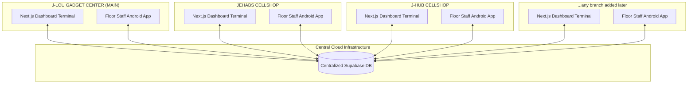

# Centralized Multi-Branch Inventory & Repair Management System

An inventory synchronization and repair tracking system for retail storefronts with
multiple locations. A single centralized Supabase PostgreSQL database coordinates
real-time stock levels, retail cashier checkouts, diagnostic repair workflows, and
branch-to-branch logistics, shared live between an Android app and a PC web dashboard.

**Status:** the schema is deployed and running on the live Supabase project. The three
stores — J-LOU GADGET CENTER (main), JEHABS CELLSHOP and J-HUB CELLSHOP — are set up and
the system is empty and ready for real stock. Nothing else needs to be configured.

---

## 🏗️ System Architecture



---

## 🗄️ Database Schema Design (Supabase PostgreSQL)

The backend schema features automated constraints, optimized indexing, and triggers that enforce data integrity.

Branches are **not hardcoded**. They are rows in a `branches` table, so stores can be
added, renamed or archived at runtime from either the Android app or the PC dashboard —
no schema change, no rebuild. Every other table references `branches.name` with
`ON UPDATE CASCADE`, so renaming a store rewrites its whole history automatically.

### Tables
1. **`branches` (Store Registry):** The addable list of stores. `name` is the natural key used by every other table; one store can be flagged `is_main`, and archiving (`is_active = false`) hides a store from all dropdowns while keeping its records.
2. **`profiles` (Staff):** Created automatically when a staff account signs up. Holds the display name, role (`owner` / `manager` / `technician` / `cashier`) and home branch.
3. **`retail_gadgets` (Serialized Track):** Stores high-value serialized units (phones and tablets) with unique `imei_1` and `imei_2` fields. Tracks status updates: `In Stock` $\rightarrow$ `In Transit` $\rightarrow$ `Sold` / `Returned`.
4. **`repair_parts` (Bulk Track):** Tracks accessories and bulk spare components (screens, batteries, flexes) by branch using unique composite keys on `(sku, branch_location)`.
5. **`service_tickets` (Repair Tracking):** Records customer repair intakes, tech assignments, diagnostic descriptions, and combined bill totals.
6. **`ticket_parts_used` (Junction Table):** Links consumed repair parts to service tickets. 
   - *Automated Trigger:* On insert/update/delete, triggers automatically subtract/revert physical stock from `repair_parts` and increment/recalculate the ticket's `total_amount`.
7. **`branch_transfers` (Logistics Log):** Logs transfer dispatches and receptions of both Serialized items (tracked by IMEI) and Bulk parts (tracked by SKU).

---

## 📱 Platforms & Features

### 1. Android Mobile Application (`/android-app`)
*Built with Kotlin, Jetpack Compose, CameraX, and Google ML Kit.*
* **Intended Users:** On-the-floor retail assistants and diagnostic technicians.
* **Camera scanner that names the device:** Direct hardware camera binding for barcodes and 15-digit IMEIs, with a torch toggle. The moment a code is read the preview freezes and a card says what it is — IMEI (Luhn-checked) or SKU — and which unit, part or open repair it belongs to. A code from a model you already stock is recognised by its TAC (the first 8 IMEI digits, shared by every handset of that model), entirely offline.
* **First-time model lookup:** For a model nobody has stocked before, the app asks the `tac-lookup` Supabase Edge Function, which names it from the TAC and caches the answer in `tac_catalog` for every device and both platforms. The provider key lives only in the function's secrets — never in the APK — and each model costs at most one lookup ever.
* **Scan-to-fill:** Scanning in Stock-In fills the blank brand / model / storage / RAM / SKU / price fields from the recognised model and warns if that IMEI is already logged; scanning in a repair intake fills the device model.
* **Stock-In receipts:** Quick input for receiving supplier shipments at the branch level, with dropdown pickers for Storage and RAM to minimize manual typing, and 15-digit IMEI validation.
* **Ticket creation:** Rapid repair intakes for customer walk-ins.
* **Branches tab:** Add a new store straight from the phone — it appears immediately in every dropdown here and on the PC dashboard, with live device / part / open-repair counts per store.
* **Home dashboard:** Landing screen with branch filter chips, four live stat cards, a reorder-soon list and the repairs currently in progress.
* **Live sync:** One Supabase realtime subscription for the whole session. Anything anyone changes — on another phone or on the PC — redraws the screen you are looking at. The header shows a **LIVE** pill while the socket is up.
* **In-app updates:** The app checks the `app_releases` table on launch (and from the ⋮ menu), downloads the new APK with a progress bar, and hands it to the Android package installer. Mandatory releases cannot be dismissed.
* **Staff sign-in:** The same Supabase account works on both platforms.

### 2. Next.js Web Dashboard (`/web-dashboard`)
*Built with Next.js 16, React 19, TypeScript, and a hand-rolled CSS design system.*
* **Intended Users:** Store managers, inventory auditors, and front-desk cashiers.
* **Master Audits:** Searchable, branch-filtered tables showcasing real-time stock balances and low-stock warning limits, complete with a 1-click **Export to CSV/Spreadsheet** feature for printable inventory reports.
* **Retail Cashier:** Interface to check out units. Scans cellphones out by changing status to `Sold` or decrements accessory quantity balances, generating receipts.
* **Service Board:** Interactive technician board to track repair diagnostics, change status, and allocate repair parts.
* **Logistics hub:** Form to dispatch branch-to-branch transfers. Shows transit statuses and handles receiving approvals to automatically update inventory location balances.
* **Branch Manager:** Add, rename, re-flag the main store, or archive a branch, with per-store device / part / open-repair counts.
* **Add forms:** Devices (with IMEI validation), parts and accessories (restocks an existing SKU at that branch instead of duplicating it), and repair tickets — all addable from the browser.
* **Analytics:** Breakdown of store performance, ticket status distributions, and cumulative revenue, computed per branch from the live branch list.
* **Live sync:** A Supabase realtime subscription refreshes the dashboard when a phone logs stock in. The sidebar pill reports the real socket state and the time of the last refresh.
* **Shared design system:** `globals.css` uses the same ink surfaces, cyan accent and status colours as the Android app, so the two platforms read as one product. Collapses to a top bar on narrow screens; `/` focuses search, `Esc` clears it.

---

## 🚀 First Run

The database is already deployed, so day one looks like this:

1. **Install the app.** Copy `builds/app-debug.apk` to the phone and install it (allow
   "install from unknown sources"). Or open the dashboard in a browser.
2. **Register a staff account.** Tap **Register** on either platform. The same account
   works on both — sign in on the phone with what you registered on the PC.
3. **Check your stores.** The three branches are already there. Add more any time from
   the **Branches** tab on the phone or **Branch Manager** on the dashboard.
4. **Start logging stock.** Use **Stock-In** on the phone (scan the IMEI with the camera)
   or **Add device / Add part** on the dashboard. Everything appears on both instantly.

**There is no demo or sample data anywhere.** The system starts empty on purpose — every
device, part, ticket and transfer is real data your staff enters.

---

## 🛠️ Installation & Setup

### Database Deployment (Supabase SQL Editor)
> Already done on the live project — you only need this to set up a second/fresh project.

Execute `supabase/schema.sql` once in the Supabase SQL Editor. It creates the enums,
tables, indexes, triggers, the `receive_branch_transfer()` function, the Row Level
Security policies, and the three store rows. Re-running it **drops and recreates
everything**, so never run it again once you have real data.

RLS denies everything to anonymous clients, so both platforms require a staff sign-in.

**Email confirmation is turned off** on the live project (Authentication → Sign In / Providers
→ User Signups → *Confirm email*). Staff registering on the shop floor get a session
immediately instead of waiting for a confirmation link, and the free tier's ~2 emails/hour
cap never blocks a signup. Turn it back on only if you start accepting public signups.

### Running the Web Dashboard
1. Navigate to the `web-dashboard` directory.
2. The live project URL and anon (publishable) key are already baked into
   `src/lib/supabase.ts`. They are safe in the client bundle because RLS gates every
   table behind a signed-in account. To point the app at a different project, set
   `NEXT_PUBLIC_SUPABASE_URL` / `NEXT_PUBLIC_SUPABASE_ANON_KEY` in `.env.local` — they
   override the defaults.
3. Install dependencies and start the development server:
   ```bash
   npm install
   npm run dev
   ```
4. Access the portal at `http://localhost:3000`.

### Building the Android App
1. Open the `/android-app` folder inside Android Studio.
2. The project URL and anon key are already set in `com.ryuuflores2006.inventorysystem.data.SupabaseHelper` — change them there only if you point the app at another project.
3. Sync Gradle and hit **Run** to launch the application on an emulator or physical testing device.
4. A ready-to-install debug build is committed at `builds/app-debug.apk`. To rebuild it:
   ```bash
   cd android-app
   ./gradlew assembleDebug
   cp app/build/outputs/apk/debug/app-debug.apk ../builds/app-debug.apk
   ```

### Deploying the Web Dashboard to Vercel
Since this project uses Supabase, deploying to Vercel is seamless:
1. Go to your [Vercel Dashboard](https://vercel.com/) and click **Add New** -> **Project**.
2. Import this GitHub repository.
3. **IMPORTANT:** Under **Root Directory**, click edit and select `web-dashboard`.
4. No environment variables are required — the client falls back to the baked-in project. Set `NEXT_PUBLIC_SUPABASE_URL` / `NEXT_PUBLIC_SUPABASE_ANON_KEY` only if you want a different backend.
5. Click **Deploy**. Vercel will build the web application and assign it a live URL (e.g., `https://your-project-name.vercel.app`).
6. From then on, any commits pushed to the `main` branch on GitHub will be automatically deployed by Vercel.

---

## ✅ Verified Behaviour

The following was tested end-to-end against the live project through the public anon key,
i.e. the exact path both apps take. Test data was deleted afterwards.

| Check | Result |
| --- | --- |
| Anonymous client can read any table | Blocked by RLS |
| Anonymous client can insert | Blocked by RLS |
| Staff registration | Signs in instantly, no confirmation email |
| Staff registration auto-creates a profile | Trigger fires |
| Staff sign-in | Works on both platforms |
| Add a branch at runtime, then stock it | Device, part and ticket all accepted |
| Duplicate IMEI | Rejected by unique constraint |
| Allocate a part to a ticket | Stock 10 → 8, invoice ₱300 → ₱400 automatically |
| Rename a branch | Cascades to all its devices, parts, tickets and transfers |
| Receive a transfer | `receive_branch_transfer()` relocates the device atomically |

---

## 🔐 Security Notes

* The **anon (publishable) key** is baked into both clients. That is by design — it is a
  public key, and Row Level Security means it grants nothing until a staff member signs
  in.
* The **service_role key** and the **database password** are never in the app code or in
  this repository. Keep them off the clients; they bypass RLS entirely.
* Every table currently grants full access to any signed-in staff account. If you later
  want cashiers restricted to their own branch, tighten the policies in section 12 of
  `supabase/schema.sql` using the `role` and `branch_name` columns already on `profiles`.
