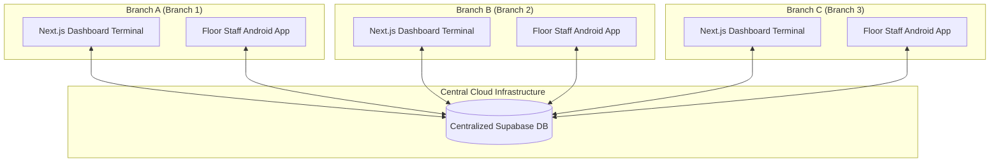

# Centralized Multi-Branch Inventory & Repair Management System

An enterprise-grade inventory synchronization and repair tracking system designed for retail storefronts with multiple locations. It uses a single centralized Supabase PostgreSQL database to coordinate real-time stock levels, retail cashier checkouts, diagnostic repair workflows, and branch-to-branch logistics.

---

## 🏗️ System Architecture



---

## 🗄️ Database Schema Design (Supabase PostgreSQL)

The backend schema features automated constraints, optimized indexing, and triggers that enforce data integrity.

### Tables
1. **`retail_gadgets` (Serialized Track):** Stores high-value serialized units (phones and tablets) with unique `imei_1` and `imei_2` fields. Tracks status updates: `In Stock` $\rightarrow$ `In Transit` $\rightarrow$ `Sold` / `Returned`.
2. **`repair_parts` (Bulk Track):** Tracks accessories and bulk spare components (screens, batteries, flexes) by branch using unique composite keys on `(sku, branch_location)`.
3. **`service_tickets` (Repair Tracking):** Records customer repair intakes, tech assignments, diagnostic descriptions, and combined bill totals.
4. **`ticket_parts_used` (Junction Table):** Links consumed repair parts to service tickets. 
   - *Automated Trigger:* On insert/update/delete, triggers automatically subtract/revert physical stock from `repair_parts` and increment/recalculate the ticket's `total_amount`.
5. **`branch_transfers` (Logistics Log):** Logs transfer dispatches and receptions of both Serialized items (tracked by IMEI) and Bulk parts (tracked by SKU).

---

## 📱 Platforms & Features

### 1. Android Mobile Application (`/android-app`)
*Built with Kotlin, Jetpack Compose, CameraX, and Google ML Kit.*
* **Intended Users:** On-the-floor retail assistants and diagnostic technicians.
* **Camera scanner:** Direct hardware camera binding to scan barcodes and 15-digit IMEIs in real-time.
* **Stock-In receipts:** Quick input interfaces for receiving supplier shipments at the branch level.
* **Ticket creation:** Rapid repair intakes for customer walk-ins.

### 2. Next.js Web Dashboard (`/web-dashboard`)
*Built with Next.js, React, TypeScript, and CSS Modules.*
* **Intended Users:** Store managers, inventory auditors, and front-desk cashiers.
* **Master Audits:** Searchable, branch-filtered tables showcasing real-time stock balances and low-stock warning limits.
* **Retail Cashier:** Interface to check out units. Scans cellphones out by changing status to `Sold` or decrements accessory quantity balances, generating receipts.
* **Service Board:** Interactive technician board to track repair diagnostics, change status, and allocate repair parts.
* **Logistics hub:** Form to dispatch branch-to-branch transfers. Shows transit statuses and handles receiving approvals to automatically update inventory location balances.
* **Analytics:** Breakdown of store performance, ticket status distributions, and cumulative revenue.

---

## 🛠️ Installation & Setup

### Database Deployment (Supabase SQL Editor)
Execute the SQL DDL commands located in [supabase/schema.sql](file:///D:/Documents/inventory-system/supabase/schema.sql) in your Supabase SQL Editor. This initializes all the enum types, indexes, tables, triggers, and populates the database with realistic seed data.

### Running the Web Dashboard
1. Navigate to the `web-dashboard` directory.
2. Setup environment keys in a `.env.local` file:
   ```env
   NEXT_PUBLIC_SUPABASE_URL=https://your-project.supabase.co
   NEXT_PUBLIC_SUPABASE_ANON_KEY=eyJhbGciOiJIUzI1NiIsInR5cCI6IkpXVCJ9.your-key-here
   ```
3. Install dependencies and start the development server:
   ```bash
   npm install
   npm run dev
   ```
4. Access the portal at `http://localhost:3000`.

### Building the Android App
1. Open the `/android-app` folder inside Android Studio.
2. Update connection configurations in `com.ryuuflores2006.inventorysystem.data.SupabaseHelper.kt` with your project URL and keys.
3. Sync Gradle and hit **Run** to launch the application on an emulator or physical testing device.
